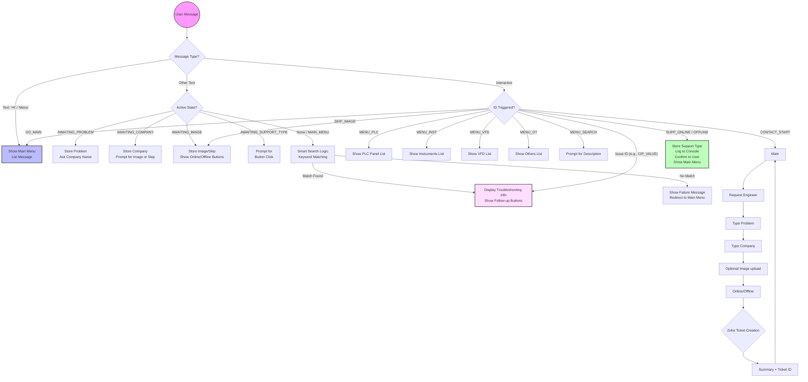

# Chatbot Flow Architecture

This diagram illustrates how the chatbot handles different user interactions, state transitions, and the internal logic for troubleshooting and engineer requests.

### Logical Components

1.  **Webhook Handler**: Receives POST requests from Meta, identifies the sender (`from`), and determines the message type (`text` vs `interactive`).
2.  **State Machine (`userState`)**: Tracks where a user is in a multi-step process (like the Engineer Request). This allows the bot to "remember" the previous answer.
3.  **Keyword Matching (`handleSmartSearch`)**: A loop that scans the `KNOWLEDGE_BASE` for keywords (e.g., "Pump", "Valve", "Temp") present in the user's free-text message.
4.  **Messaging Utility**: Abstracted functions (`sendList`, `sendButtons`, `sendText`) that format the JSON required by the WhatsApp Graph API.

### State Transitions for "Request Engineer"
| Current State | Input Received | Next State | Action |
| :--- | :--- | :--- | :--- |
| `None` | Button: `CONTACT_START` | `AWAITING_PROBLEM` | Ask for description |
| `AWAITING_PROBLEM` | Text (Problem) | `AWAITING_COMPANY` | Store problem, ask company |
| `AWAITING_COMPANY` | Text (Company) | `AWAITING_IMAGE` | Store company, prompt for image |
| `AWAITING_IMAGE` | Image / Skip Button | `AWAITING_SUPPORT_TYPE` | Store Image, show buttons |
| `AWAITING_SUPPORT_TYPE` | Button: `SUPP_ONLINE` | `None` / `MAIN_MENU` | Finalize, log, and reset |
